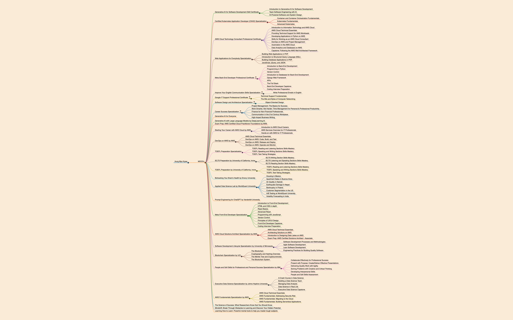

---
markmap:
  colorFreezeLevel: 3
  autoFit: true
  embedAssets: true
  pan: false
  zoom: false
---

# [Aung Myo Kyaw](https://www.aungmyokyaw.com)

  

  

## [MOOCs](https://moocs.aungmyokyaw.com)

### [Generative AI for Everyone](https://www.coursera.org/account/accomplishments/certificate/Z6QW8NAPQBZA)

### [Generative AI with Large Language Models by DeepLearning.AI](https://www.coursera.org/account/accomplishments/certificate/4XL2AJ4C3WBF)

### [Exam Prep: AWS Certified Cloud Practitioner Foundations by AWS](https://www.coursera.org/account/accomplishments/certificate/5L8B7DTJRTJM)

### [Starting Your Career with AWS Cloud by AWS](https://www.coursera.org/account/accomplishments/specialization/certificate/9JWTJ3TCB4HQ)

- [Introduction to AWS Cloud Careers](https://www.coursera.org/account/accomplishments/certificate/H9F2NQQDCTGY)
- [AWS Services Overview for IT Professionals](https://www.coursera.org/account/accomplishments/certificate/XHKW6EH2KYMY)
- [Hands-on with AWS for IT Professionals](https://www.coursera.org/account/accomplishments/certificate/P8UDMHYHUGGK)

### [DevOps on AWS by AWS](https://www.coursera.org/account/accomplishments/specialization/certificate/ZABFPBZJTSA6)

- [AWS Cloud Technical Essentials](https://www.coursera.org/account/accomplishments/certificate/68M99ZNUD4WE)
- [DevOps on AWS: Code, Build, and Test](https://www.coursera.org/account/accomplishments/certificate/2GH4UJGV3VDH)
- [DevOps on AWS: Release and Deploy](https://www.coursera.org/account/accomplishments/certificate/7QNHSQP44B3V)
- [DevOps on AWS: Operate and Monitor](https://www.coursera.org/account/accomplishments/certificate/6D8HLEQ2M696)

### [ IELTS Preparation by University of California, Irvine](https://www.coursera.org/account/accomplishments/specialization/certificate/B7EP3UEJKKP4)

- [IELTS Writing Section Skills Mastery](https://www.coursera.org/account/accomplishments/certificate/ZJESXLZCC5QS)
- [IELTS Listening and Speaking Sections Skills Mastery](https://www.coursera.org/account/accomplishments/certificate/EUL799SSF3BB)
- [IELTS Reading Section Skills Mastery](https://www.coursera.org/account/accomplishments/certificate/ZYSX7BSV6HLC)

### [ TOEFL Preparation by University of California, Irvine](https://www.coursera.org/account/accomplishments/specialization/certificate/BA3GT7GYU533)

- [ TOEFL Reading and Listening Sections Skills Mastery ](https://www.coursera.org/account/accomplishments/certificate/JBZZW394SBJQ)
- [ TOEFL Speaking and Writing Sections Skills Mastery ](https://www.coursera.org/account/accomplishments/certificate/5ZMC2PPKKRE7)
- [ TOEFL Test-Taking Strategies ](https://www.coursera.org/account/accomplishments/certificate/CEDEZZ4QSBWW)

### [Biohacking Your Brain's Health by Emory University](https://www.coursera.org/account/accomplishments/certificate/7QVQDJLZAF73)

### [Applied Data Science Lab by WorldQuant University](https://www.credly.com/badges/72d4d407-f65d-4df9-8cc7-156aeb74bfbb)

### [Prompt Engineering for ChatGPT by Vanderbilt University](https://www.coursera.org/account/accomplishments/certificate/TWXADA5XBUQR)

### [Meta Front-End Developer Specialization](https://www.coursera.org/account/accomplishments/specialization/certificate/X5EVPVJSCPFH)

- [Introduction to Front-End Development](https://www.coursera.org/account/accomplishments/certificate/3ZXBQMYRVE4J)
- [HTML and CSS in depth](https://www.coursera.org/account/accomplishments/certificate/UZ8E4TBRTN7M)
- [React Basics](https://www.coursera.org/account/accomplishments/certificate/CTXJVSP4WNPP)
- [Advanced React](https://www.coursera.org/account/accomplishments/certificate/G9CCMJEK4RRJ)
- [Programming with JavaScript](https://www.coursera.org/account/accomplishments/certificate/99AV9256857Z)
- [Version Control](https://www.coursera.org/account/accomplishments/certificate/ZGLGS7UQPMVE)
- [Principles of UX/UI Design](https://www.coursera.org/account/accomplishments/certificate/UUS2L4B8RPT3)
- [Front-End Developer Capstone](https://www.coursera.org/account/accomplishments/certificate/GSPNXQK23TDB)
- [Coding Interview Preparation](https://www.coursera.org/account/accomplishments/certificate/DHWSJ3JJKMEV)

### [AWS Cloud Solutions Architect Specialization by AWS](https://www.coursera.org/account/accomplishments/specialization/certificate/NGP2326FQRPB)

- [AWS Cloud Technical Essentials](https://www.coursera.org/account/accomplishments/certificate/68M99ZNUD4WE)
- [Architecting Solutions on AWS](https://www.coursera.org/account/accomplishments/certificate/BLYG7X4MNKXQ)
- [Introduction to Designing Data Lakes on AWS](https://www.coursera.org/account/accomplishments/certificate/FTB775T8ZU8D)
- [Exam Prep: AWS Certified Solutions Architect - Associate](https://www.coursera.org/account/accomplishments/certificate/83LV6G6VPGPH)

### [Software Development Lifecycle Specialization by University of Minnesota](https://www.coursera.org/account/accomplishments/specialization/certificate/H2UZFJYXWN7W)

- [Software Development Processes and Methodologies](https://www.coursera.org/account/accomplishments/certificate/SD2EMT2SRLCG)
- [Agile Software Development](https://www.coursera.org/account/accomplishments/certificate/FACMLKZAZUCL)
- [Lean Software Development](https://www.coursera.org/account/accomplishments/certificate/WABZAU3U3CAM)
- [Engineering Practices for Building Quality Software](https://www.coursera.org/account/accomplishments/certificate/WJCEX3BPKADK)

### [Blockchain Specialization by UCI](https://www.coursera.org/account/accomplishments/specialization/certificate/ZJQWD2GKVMWZ)

- [The Blockchain](https://www.coursera.org/account/accomplishments/certificate/6A8L86YAYGXV)
- [Cryptography and Hashing Overview](https://www.coursera.org/account/accomplishments/certificate/2D4JE4R89J43)
- [The Merkle Tree and Cryptocurrencies](https://www.coursera.org/account/accomplishments/certificate/PUMVQXTNLLRD)
- [The Blockchain System](https://www.coursera.org/account/accomplishments/certificate/CKLJC3UKJNWS)

### [People and Soft Skills for Professional and Personal Success Specialization by IBM](https://www.coursera.org/account/accomplishments/specialization/certificate/B7NR4R4ETSJB)

- [Collaborate Effectively for Professional Success](https://www.coursera.org/account/accomplishments/certificate/XYEPHPQZPCRK)
- [Present with Purpose: Create/Deliver Effective Presentations](https://www.coursera.org/account/accomplishments/certificate/ZUE9M3KPAJ6K)
- [Delivering Quality Work with Agility](https://www.coursera.org/account/accomplishments/certificate/QLDYNHU7GDCN)
- [Solving Problems with Creative and Critical Thinking](https://www.coursera.org/account/accomplishments/certificate/UNSACKS3P7AG)
- [Developing Interpersonal Skills](https://www.coursera.org/account/accomplishments/certificate/PUUG3VU94B9R)
- [People and Soft Skills Assessment](https://www.coursera.org/account/accomplishments/certificate/ZHL2B5JT9S7G)

### [Executive Data Science Specialization by Johns Hopkins University](https://www.coursera.org/account/accomplishments/specialization/certificate/CCA4K99FLBY9)

- [A Crash Course in Data Science](https://www.coursera.org/account/accomplishments/certificate/R6RBPNAFLKK5)
- [Building a Data Science Team](https://www.coursera.org/account/accomplishments/certificate/A39XE6CPCFRK)
- [Managing Data Analysis](https://www.coursera.org/account/accomplishments/certificate/QGHH247Y3HZJ)
- [Data Science in Real Life](https://www.coursera.org/account/accomplishments/certificate/6J7XWCL3GY7Q)
- [Executive Data Science Capstone](https://www.coursera.org/account/accomplishments/certificate/8VWJC599HLVE)

### [AWS Fundamentals Specialization by AWS](https://www.coursera.org/account/accomplishments/specialization/certificate/WZ2NC5LE482W)

- [AWS Cloud Technical Essentials](https://www.coursera.org/account/accomplishments/certificate/68M99ZNUD4WE)
- [AWS Fundamentals: Addressing Security Risk](https://www.coursera.org/account/accomplishments/certificate/7NNZGQ4LWGE6)
- [AWS Fundamentals: Migrating to the Cloud](https://www.coursera.org/account/accomplishments/certificate/4UAE98GYK9ZL)
- [AWS Fundamentals: Building Serverless Applications](https://www.coursera.org/account/accomplishments/certificate/YK6PX8ZWCNUY)

### [The Science of Success: What Researchers Know that You Should Know](https://www.coursera.org/account/accomplishments/certificate/3SCV47QQK7JE)

### [Mindshift: Break Through Obstacles to Learning and Discover Your Hidden Potential](https://www.coursera.org/account/accomplishments/certificate/MBB63XT9RKNB)

### [Learning How to Learn: Powerful mental tools to help you master tough subjects](https://www.coursera.org/account/accomplishments/certificate/2UZ5KDXDHX98)
